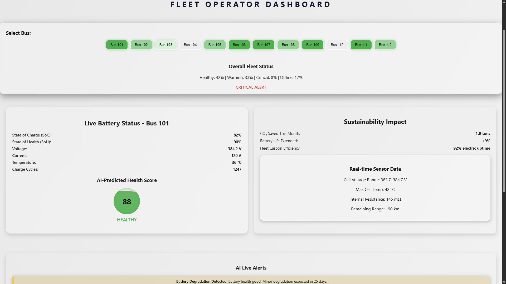
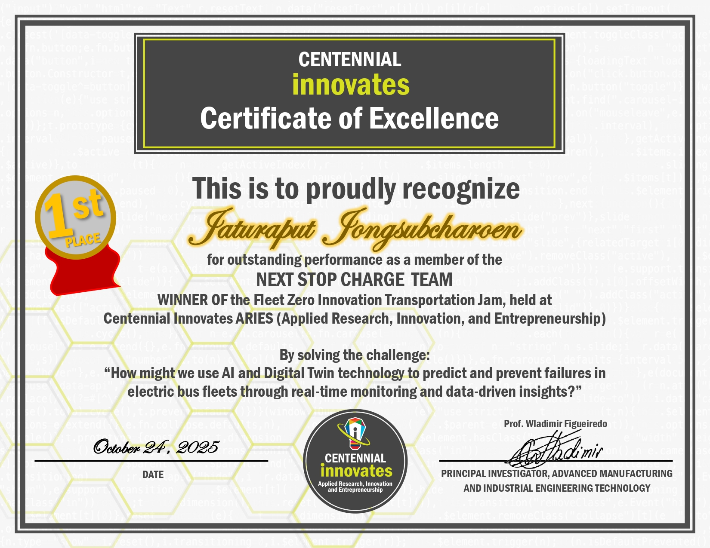

# AI Battery Intelligence with Digital Twin - Frontend

## Hackathon Highlight — 1st Place Winner 🏆

[](https://frontend-hackathon-next-stop-station.onrender.com/)

[](https://client-jaturaput-portfolio.onrender.com/certificate/Jaturaput_Jongsubcharoen-Certificate_FleetZero-Centennial_Innovates_Jam.pdf)

This frontend was created for the **Fleet Zero Innovation Transportation Jam** by team **NextStop Charge**, where the project won **1st Place**.

- Project: **AI Battery Intelligence with Digital Twin**
- Team: **NextStop Charge**
- Recognition: **Certificate of Excellence - 1st Place**
- Event host context: **Centennial Innovates ARIES (Applied Research, Innovation, and Entrepreneurship)**
- Certificate date: **October 24, 2025**
- Live demo (Operator Dashboard): [https://frontend-hackathon-next-stop-station.onrender.com/](https://frontend-hackathon-next-stop-station.onrender.com/)
- Live demo (Driver Monitor, /driver version): [https://frontend-hackathon-next-stop-station.onrender.com/driver-monitor](https://frontend-hackathon-next-stop-station.onrender.com/driver-monitor)
- Backend API (health): [https://backend-hackathon-next-stop-station-node.onrender.com/api](https://backend-hackathon-next-stop-station-node.onrender.com/api)
- Backend API (battery data): [https://backend-hackathon-next-stop-station-node.onrender.com/api/battery](https://backend-hackathon-next-stop-station-node.onrender.com/api/battery)
- Backend API (trend data): [https://backend-hackathon-next-stop-station-node.onrender.com/api/battery/trend](https://backend-hackathon-next-stop-station-node.onrender.com/api/battery/trend)
- Backend API (per-bus trend example): [https://backend-hackathon-next-stop-station-node.onrender.com/api/battery/trend/101](https://backend-hackathon-next-stop-station-node.onrender.com/api/battery/trend/101)
- Frontend repo: [Frontend-Hackathon-Next-Stop-Station](https://github.com/Jaturaput-Jongsubcharoen/Frontend-Hackathon-Next-Stop-Station)
- Backend repo: [Backend-Hackathon-Next-Stop-Station-Node](https://github.com/Jaturaput-Jongsubcharoen/Backend-Hackathon-Next-Stop-Station-Node)

## What This App Does

This React app provides two dashboard experiences for electric bus battery intelligence:

- **Fleet Operator Dashboard** (`/`): Fleet-wide monitoring and predictive maintenance decisions.
- **Driver Vehicle Monitor** (`/driver-monitor`): Driver-focused quick health status panel.

The product demonstrates how AI signals + digital twin data can reduce failure risk through proactive insights.

## Tech Stack

- React 19 + Vite
- React Router
- Axios
- Recharts
- CSS (glassmorphism-style dashboard visuals)

## Dashboard Routes

- Operator dashboard: `/`
- Driver monitor dashboard: `/driver-monitor`

## Fleet Operator Dashboard Features

### 1. Topbar and system context

- Fleet branding and product identity.
- Active bus count vs total bus count.
- "System Online" state and last-update timestamp.

### 2. Bus selector panel

- Interactive buttons for each bus (Bus 101-112).
- Color/state styling based on health condition and maintenance/offline status.
- Active selection animation and state indicator.

### 3. Overall fleet status overview

- Computes percentages for:
	- Healthy
	- Warning
	- Critical
	- Offline
- Generates high-level fleet state labels:
	- `OVERALL GOOD`
	- `WARNING`
	- `CRITICAL ALERT`
	- `MAINTENANCE MODE`

### 4. Live battery status card

Per selected bus, shows:

- State of Charge (SoC)
- State of Health (SoH)
- Voltage / Current / Temperature
- Charge cycles
- AI-predicted health score circle with condition-based visual intensity

### 5. Sustainability impact panel

- CO2 saved this month
- Battery life extension percentage
- Fleet electric uptime indicator
- Real-time sensor block:
	- Cell voltage range
	- Max cell temperature
	- Internal resistance
	- Remaining range

### 6. AI live alerts and prediction panel

- Predictive degradation alert text.
- Optimization recommendation.
- Estimated failure risk and risk level.
- 7-day battery performance trend chart.

### 7. Maintenance workflow modal

- "Schedule Maintenance Now" action.
- Selected bus summary with current condition and risk.
- Confirm/cancel controls for simulated scheduling flow.

## Driver Vehicle Monitor Features (Important)

The driver-focused view is intentionally simpler and fast to read while driving operations:

### 1. Driver topbar

- Current bus ID.
- Online/maintenance state.
- Last updated timestamp.

### 2. Driver battery health card

- SoC, SoH, charge cycles.
- AI-predicted health score.
- Strong condition labels for immediate decisions:
	- `HEALTHY`
	- `WARNING`
	- `CRITICAL`
	- `MAINTENANCE`

### 3. Why this matters

- Helps drivers quickly identify whether a vehicle can continue safely.
- Surfaces high-level battery risk without requiring full operator-level analytics.
- Supports communication between drivers and operations/maintenance teams.

## Data Flow

1. Frontend requests fleet data from backend `GET /api/battery`.
2. Operator dashboard renders fleet and selected-bus cards.
3. Prediction chart calls `GET /api/battery/trend/:busId`.
4. Driver dashboard uses backend data to display a concise vehicle health card.

## Local Installation and Run

### 1. Clone

```bash
git clone https://github.com/Jaturaput-Jongsubcharoen/Frontend-Hackathon-Next-Stop-Station.git
cd Frontend-Hackathon-Next-Stop-Station
```

### 2. Install dependencies

```bash
npm install
```

### 3. Configure environment

Create/update `.env`:

```env
VITE_BE_URL=http://localhost:8084
```

### 4. Start development server

```bash
npm run dev
```

### 5. Open app

- Operator: `http://localhost:5173/`
- Driver: `http://localhost:5173/driver-monitor`

## Build for Production

```bash
npm run build
npm run preview
```

## Backend Setup (Required)

Run backend in parallel:

1. Clone backend repo.
2. Add backend `.env`:

```env
PORT=8084
URL_FRONTEND=http://localhost:5173
```

3. Start backend with `npm run start`.

## Skills Demonstrated in This Hackathon

This project showcases the skills used to earn 1st place:

- End-to-end full-stack integration (React + Node.js API).
- UI/UX prototyping and dashboard information hierarchy.
- Data visualization for battery trends and predictive risk.
- Digital twin style telemetry modeling for EV fleet operations.
- Predictive maintenance workflow design.
- Multi-role experience design (operator and driver personas).
- API-driven state management and real-time style status updates.
- Deployment mindset for cloud-hosted demo environments.

## License

MIT (see `LICENSE`)
